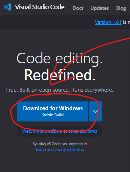
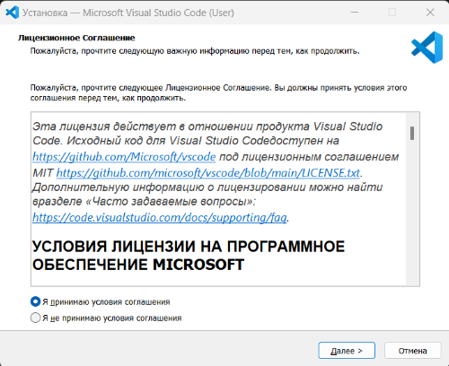
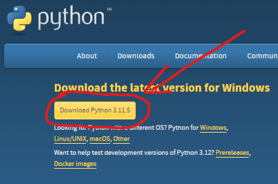
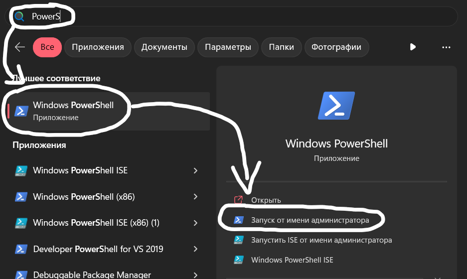
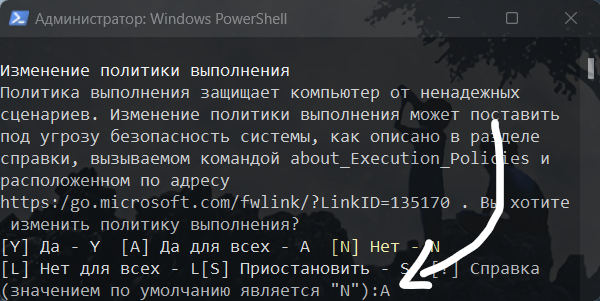
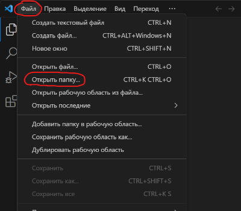
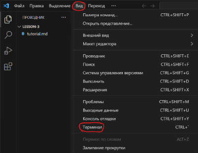

# Вводный урок
Всем привет и сегодня мы начинаем изучение большой темы, а именно - backend разработка.<br> 
Давайте вспомним, что при открытии обычного html файла в браузере, мы видим подобный путь<br>
`C:\\Users\\xL\\Desktop\\example`<br>
Что это за путь?<br>
Это путь к данному `index.html` файлу на вашем компьютере. <br>
Так же мы можем увидеть его в проводнике(показываем), откуда мы его и открывали раньше.<br> 
То есть начинается путь с диска C...(рассказываем про пути в OS)<br>
В браузере подобные пути называются адресами.<br>
Давайте сравним адрес настоящего сайта с адресом нашего файла.<br>
Видим, что они отличаются(показываем отличия). <br>
Данный сайт загружен на хостинг или по другому, на внешний сервер. На этом занятии мы 
научимся запускать собственный локальный сервер на нашем компьютере и сделаем наш первый 
простой сайт с backend'ом.

## Устанавливаем `VSCode` и `Python`. 
> Обращайте внимание на кириллицу в путях, иногда перекодировка 
файлов виртуальной среды, особенно на `Windows`, может привести к проблемам.
Лучше устанавливать программы по путям без кириллицы, однако это не критично.

>Естественно объясняем зачем и что такое python, vscode.
1. ### Скачиваем VSCode и запускаем установщик.
   
   * Windows 10/11 - https://code.visualstudio.com/
   * Windows 8 - https://code.visualstudio.com/updates/v1_79
   * Windows 7 - https://code.visualstudio.com/updates/v1_70
  
2. ### Принимаем пользовательское соглашение.
   
3. ### Нажимаем `Далее` и `Установить`
4. ### После установки закрываем окно.

5. ### Скачиваем `Python` и запускаем установщик.
   Windows 8/10/11 - Python 3.12<br>
   Windows 7 - Python 3.8<br><br>
   
   * Python 3.8
     * x32 - https://disk.yandex.ru/d/JUwas1C27xAqAw
     * x64 - https://disk.yandex.ru/d/mlsAGCdBBVzvaw
   * Python 3.12
     * x32 - https://disk.yandex.ru/d/d-Mby94JASvlig
     * x64 - https://disk.yandex.ru/d/pRh2xVPo86MFpQ
   
     Или с официального сайта.<br><br>
   
   
6. ### Добавляем путь до python в переменные среды и нажимаем установить.
   
7. ### После установки закрываем окно.

8. ### Чтобы команды из терминала отрабатывали корректно, нужно разрешить выполнение сторонних скриптов.
    
   * #### В поиске Windows находим `PowerShell` и запускаем от имени администратора.<br>
       <br><br>
   * #### Прописываем команду `Set-ExecutionPolicy RemoteSigned`, нажимаем enter.<br>
       <br><br>
   * #### Вводим `A` принимая изменения для всех пользователей или `Y` для текущего.<br>
      <br><br>
   
9. ### Запускаем VSCode от имени `Администратора`. Создаем где удобно папку для будущего проекта и открываем ее в VSCode.
   
10. ### Открываем терминал и рассказываем что это.
   
11. ### Расскажите о базовых командах (*ls | cd .. | cd some/path*)

>Если в терминале не пишутся заглавные буквы, то нужно закрыть 
>терминал, переключиться на ENG раскладку и открыть новый терминал.

## Старт проекта
>Команды пишем в терминале.

1. **Создание *виртуальной среды* с именем *venv_name*.**

    `python -m venv venv_name`<br><br>

2. **Активация *виртуального окружения*.**

    `./venv_name/Scripts/activate`<br>
    > Если интерпретатор питона не обнаруживается в терминале,
    то проблема либо в его отсутствии, либо в путях.<br>
    Проверьте верно ли указан путь до python в системных переменных и
    в конфигурации виртуального окружения (`venv/pyvenv.cfg`).<br>
    Обращайте внимание на кириллицу в путях, иногда перекодировка 
    файлов виртуальной среды, особенно на `Windows`, может привести к проблемам. 
3. **Установка *django*.<br>**
   Рассказываем, что такое pip и django это и зачем.<br>
   _Слова 'Пакетный менеджер и web-framework' будут недостаточны._
   
   `pip install django`<br><br>

4. **Создание *django* проекта с именем *project_name*.**<br>
   Рассказываем, что такое проект в django.<br>
   Назовем проект `config` для того что бы внутренняя одноимённая <br>
   папка с настройками синхронного, асинхронного сервера и файл <br>
   настроек проекта лежали в папке с корректным названием - `config`.
   
   `django-admin startproject config`<br><br>

5. **Переходим в директорию созданного проекта.**<br> 
   Рассказываем про базовые команды навигации в терминале.
   `ls` `cd` `..` `.`
   
   `cd ./project_name`<br><br>

6. **Запуск сервера *django*.<br>**
   Рассказываем что такое сервер.
   
   `python manage.py runserver`<br><br>
7. **Проверяем что сервер работает.**<br>
   Переходим на `http://127.0.0.1:8000/`. <br><br>

8. **Создаем django приложение с именем *app_name*.<br>**
   Рассказываем, что такое приложения в django и зачем они нужны.<br>
   Приложение лучше назвать `core`.<br>
   В нем в теории будут находиться все базовые<br>
   элементы сайта(логотип сайта, стандартные css/js, базовые страницы и т.д. и т.п.)<br>
   `python manage.py startapp core`<br><br>

9. **Подключаем приложение к проекту.**<br>
    ```python
    # settings.py
    INSTALLED_APPS = [
        # Тут уже есть базовые приложения которые нужны для поддержки сессий 
        # статических файлов админки сигнал слотовой архитектуры и т.д.
        ...,
        ...,
        'app_name',
    ]
    ```

10. **Создаём `app_name/templates/app_name/some_template_name.html`<br>**
   Рассказываем, что такое шаблоны и почему путь именно такой.<br>
   📦project_name `Корневая папка проекта`<br>
    ┣- 📜manage.py<br>
    ┣- 📂project_name `Конфигурация проекта`<br>
    ┣- 📂app_name `Приложение с именем app_name`<br>
    ┃  ┣- 📂migrations `Файлы миграций`<br>
    ┃  ┣- 📂templates `Шаблоны`<br>
    ┃  ┃  ┣- 📂app_name `Шаблоны app_name приложения`<br>
    ┃  ┃  ┃  ┗- 📜some_template_name.html<br>


## Создание первой странички
Следующий код свяжет адрес `example_url/` с рендером `some_template_name.html` странички. 
То есть когда мы перейдем в браузер по ссылке `http://127.0.0.1:8000/example_url/`
будет отрендерен шаблон `some_template_name.html`. Важно, что это не просто отправка html файла, а именно рендер.
В будущем мы будем передавать в html шаблоны переменные и обрабатывать их там же.
Это происходит с помощью render функции которая прогоняет html через шаблонизатор.

> Шаблон, функцию и маршрут называть можно пока что как угодно.
```python
    # app_name/views.py
    def example(request):
        return render(request, 'app_name/some_template_name.html')
```
```python
    # project_name/urls.py
    from app_name.views import example  # импортируем функцию
    
    urlpatterns = [
        path('example_url/', example),  # связываем маршрут и функцию
    ]
```

## Познакомьте учеников со **[шпаргалкой](https://github.com/xlartas/it-compot-backend-methods)**
> Отправьте ссылку ученикам в чат. Пока что нас интересует раздел Django Base.

## Небольшая самостоятельная
Пусть ученики попробуют сами связать 
**[готовый html](https://raw.githubusercontent.com/Artasov/it-compot-backend-lessons/main/lessons/lesson-1/template/index.html)** 
с адресом. Названия функции, шаблона и адреса по их желанию.
>Просто скиньте ссылку на файл в чат. В открывшемся окне ПКМ и 'сохранить как' или 'сохранить страницу' или на крайний случай просто все скопировать и вставить в html файл.

## Если осталось время начинаем работу с Git по гайду в конце второго урока.

