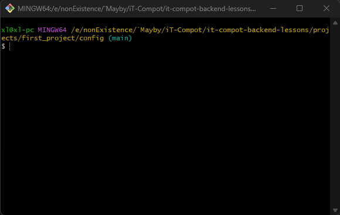

# Учимся минимально работать с Git
Расскажите что такое git. Что такое отслеживание файлов, что такое коммит, что такое push. <br>
Можете даже перед какими-либо действиями пройтись по этим командам и подробо описать, что они делают.
```git
git init
git add blog/urls.py Просто пример
git add .
git commit -m "init commit"
git branch -M main
git remote add origin https://github.com/nickname/repo.git
git push -u origin main
```
`git init`
Эта команда инициализирует новый Git-репозиторий в текущем каталоге. <br>
Она создает новую подпапку .git, содержащую все необходимые файлы репозитория.<br>
Эта папка необходима для работы git.

`git add blog/urls.py`
Эта команда добавляет файл blog/urls.py в область **_отслеживаемых_** файлов (staging area). <br>
Это означает, что Git начинает отслеживать изменения в этом файле.

`git add .`
Такая же как и предыдущая, но добавляет все новые и измененные файлы в текущем <br>
каталоге (и во всех подкаталогах)(то есть рекурсивно) в область отслеживаемых файлов. <br>


`git commit -m "init commit"`
Эта команда создает коммит(сохранение как в игре), то есть фиксирует текущее состояние **_отслеживаемых_** файлов <br>
в истории репозитория. -m "init commit" добавляет к коммиту сообщение, описывающее произведенные изменения<br>
Относительно предыдущего коммита.

`git branch -M main`
Эта команда переименовывает текущую ветку в main. Git по умолчанию создает ветку с именем <br>
master, но недавний сдвиг в номенклатуре привел к более широкому использованию main как имени основной ветки.

`git remote add origin https://github.com/nickname/repo.git`
Эта команда создает новый удаленный репозиторий с именем origin для текущего <br>
локального репозитория. https://github.com/nickname/repo.git — это адрес удаленного <br>
репозитория на GitHub, куда будет отправляться код. <br>
Проще говоря подключаемся к нашему созданному(через сайт) репозиторию.

`git push -u origin main`

Эта команда отправляет коммиты из локальной ветки main в удаленный репозиторий origin  <br>
(который был добавлен в предыдущей команде). Опция `-u` устанавливает ветку `main` на origin  <br>
в качестве ветки по умолчанию для текущего репозитория, так что в будущем достаточно  <br>
будет просто использовать `git push` для отправки изменений в эту ветку.


1. ### Скачиваем [GitBash](https://gitforwindows.org/) и запускаем установщик.
   git bash - это консоль `Linux` для `Windows`(Если по простому)<br>
   Теперь мы будем работать исключительно с помощью него, ВСЕГДА.<br>
   

2. ### Нажимаем Next пока не произойдет установка и *оставляем все настройки по умолчанию*.
    > *Можно путь установки поменять

3. ### Перейдите через обычный проводник в папку со СТАРЫМ проектом там где лежит manage.py.
   > Напомните, что именно это считается корневой папкой проекта Django.
   
   Правой кнопкой в папке в пустом месте и выбираем `Open Git Bash here`.
   Если Win11 то Shift + RMB<br>
   <br>
   Должен открыться терминал.<br>
   <br>
   Обратите внимание, что мы как раз находимся в той папке откуда вызвали Git.
4. ### Создаем новый репозиторий в `github` через сайт.
5. ### Рассказываем зачем **[.gitignore](https://github.com/xlartas/it-compot-backend-methods/blob/main/.gitignore)** и отправляем им ссылку на скачивание.
    >Этот файл лежит в репозитории со шпаргалками для учеников, можно оттуда скачать
6. ### В терминале инициализируем git.
   `git init`
   #### Начиная с этого места после каждой команды пишите git status, чтобы детально прослеживать изменения. Пояснейте, то что выводит git status.
7. ### Добавим 1 файл в отслеживание, любой, кроме тех что в gitignore естественно 🙄.
   `git add blog/urls.py`
8. ### Пишем git status.
9. ### Внесите изменения в этот файл (поставьте пробел...) и еще раз напишите git status.
10. ### Добавляем в отслеживание все файлы в директории рекурсивно.
   `git add .`
11. ### Создаем commit с комментарием
   >Как в игре сохранение, только его еще повторно нужно будет сохранить через push 🙃

   `git commit -m "init commit"`
12. ### Переключаемся на ветку main в локальном репозитории.
    Потому что так принято...
   `git branch -M main`
13. ### Подключаемся к нашему созданному репозиторию.
    > Ссылку можно взять со страницы после создания репозитория.<br>
      Либо сформировать указав username и название репозитория.
    
   `git remote add origin https://github.com/nickname/repo.git`
14. ### Пушим
    
   `git push -u origin main`

15. ### Появится ошибка которая говорит о том, что нужно сконфигурировать git на компьютере.
    Пишем две команды которые подскажет git заменяя<br> 
    username и почту в кавычках на соответствующие данные от аккаунта git.<br> 

    `git config --global user.name "Your Username"`<br> 
    `git config --global user.email "youremail@yourdomain.com"`

16. ### Пробуем запушить еще раз.
17. ### Перезагрузите страницу с гитом и увидете, что файлы уже там.
18. ### Попробуйте внести любые изменения в какие-нибудь файлы и использовать последовательность команд ниже для загрузки новых изменений.
   >В дальнейшем мы будем использовать следующую связку комманд для обновления репозитория.
   > ```git
   > git add .
   > git commit -m "ПОМЕНЯЙИЕ КОММЕНТАРИЙ К КОММИТУ"
   > git push
   >```
19. ### Обновите страницу репозитория. Расскажите о выделенных элементах на скриншоте.
   <br>

20. ### Перезапускаем VSCode добаляем `bash` терминал в `VSCode` и далее пишем _ВСЕГДА_ в нём.

   

21. ### Создайте новый репозиторий для нашего нового проекта shop и повторите процедуру инициализации и первого пуша.

### Активация виртуального окружения, кстати, теперь будет выглядеть немного иначе:<br> 
### `source venv/Scripts/activate`

# Теперь в конце каждого урока не забывайте делать
