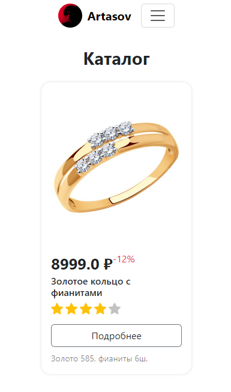

# Карточка товара.

Сегодня мы подключим админку и сделаем карточку товара для магазина.
Но перед этим доделаем если что-то не успели с предыдущего занятия.


1. ## Подключим административную панель
    > Одну показываем, вторую пусть сами, или обе сами ...
    ```python
    from .models import Product, Order
    from django.contrib import admin
    
   
    @admin.register(Product)
    class ProductAdmin(admin.ModelAdmin):
        list_display = (
            'name',
            'price',
            'rating',
            ...  # и другие поля которые хотите.
        )
        list_editable = (
            'price',
        )
    
    
    @admin.register(Order)
    class OrderAdmin(admin.ModelAdmin):
        list_display = (
            'id',
            'product',
        )
    ```

2. ## Создаём карточку товара
    Как обычно, используем Bootstrap.<br>
    Берём [шаблон карточки](https://getbootstrap.com/docs/5.3/components/card/) 
    и добавляем на него все необходимое:<br>
    * Изображение, название, цену, скидку, рейтинг, описание, кнопку
    >Отображайте меньше полей если понимаете, что ученики не успеют.<br>
     Не отображайте рейтинг как в примере, если не уверены, что успеете. 
    ```html
    <!-- shop/catalog.html  -->
    
    
    SHOP | Catalog
    
        <h1 class="text-body text-center fw-bold mb-4">Каталог</h1>
        <div class="d-flex gap-3 flex-wrap justify-content-center mx-auto" 
             style="max-width: 800px;">
            <div class="card border-0 rounded-4" style="width: 250px; box-shadow: 0 0 5px #00000022">
                <!-- Пусть вспомнят как картинку из интернета вставить -->
                
                <div class="card-body d-flex flex-column">
                    <span class="card-text d-flex mt-auto">
                        <span class="fs-2 fw-bold">12 000 ₽</span>
                        <span class="text-danger fs-6">-50%</span>
                    </span>
                    <h3 class="card-title fs-6">Кольцо из желтого золота с фианитами</h3>
                    <div class="d-flex gap-1 mb-3">
                        <!-- Картинку нужно естественно найти по первой 
                             ссылке по запросу 'star icon' и поместить в 
                             project_root/shop/static/shop/img/rating_star.png,
                             вспомни заодно, что такое статические файлы -->
                        
                        
                        
                        
                         <!-- серая звездочка -->
                    </div>
                    <button class="btn btn-outline-secondary text-dark">Подробнее</button>
                    <small class="text-black-50 mt-2">
                        Жёлтое золото 585 пробы<br>
                        Примерный вес 1.5 г<br>
                        Фианит (3 шт)<br>
                    </small>
                </div>
            </div>
        </div>
   
    ```
   
3. ## Если все успели
    **Дайте ученикам самим попробовать добавить какой-то готовый [компонент](https://getbootstrap.com/docs/5.3/components/) 
    из Bootstrap, например, <br>
    [аккордион](https://getbootstrap.com/docs/5.3/components/accordion/) 
    или [карусель](https://getbootstrap.com/docs/5.3/components/carousel/) 
    или...**

## Подведите итоги.
># git push...