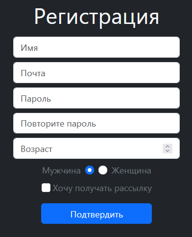
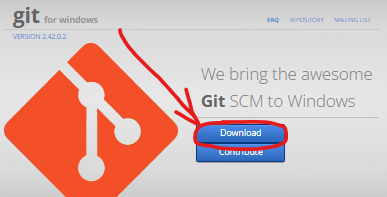
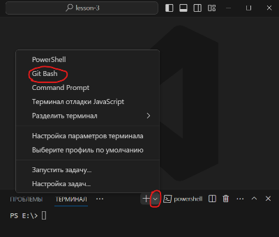

# Статические файлы, тэг form, bootstrap, git
Работа с сервером почти во всех случаях сопровождается обменом данных между клиентом и сервером
и сегодня мы научимся создавать форму для ввода пользовательских данных и отправлять их на сервер.
Для примера будем делать форму регистрации новых пользователей. В дальнейшем используем её когда 
будем работать с User в django.

## Делаем форму на новой странице регистрации.
Рассказываем о разных видах input'ов и вообще о тэге form и его атрибутах.
```html
<h1>Регистрация</h1>
<form action="Если не писать, то отправка идёт на текущий адрес." method="get">
    <input type="text" placeholder="Имя" name="name">
    <input type="email" placeholder="Почта" name="email">
    <input type="password" placeholder="Пароль" name="password">
    <input type="password" placeholder="Повторите пароль" name="password_repeat">
    <span>Мужчина</span>
    <input class="form-check-input" type="radio" name="gender" id="male" value="male">
    <input class="form-check-input" type="radio" name="gender" id="female" value="female">
    <span>Женщина</span>
    <button type="submit">Подтвердить</button>
</form>
```

## На этом этапе ученики скорее всего захотят стилизировать форму.
Рассказываем и показываем что такое `bootstrap` и зачем он нужен.<br>
Подключаем **[Bootstrap](https://cdn.jsdelivr.net/npm/bootstrap@5.3.1/dist/css/bootstrap.min.css)**.<br>
Обязательно показываем, что это обычный css файл, чтобы они не пугались.
```html
<head>
    <link rel="stylesheet" 
          href="https://cdn.jsdelivr.net/npm/bootstrap@5.3.1/dist/css/bootstrap.min.css"> 
</head>
```

Обновляем страницу и видим, что уже что-то изменилось.<br>
Начинаем стилизировать.
>Я бы не рассказывал про сетку
>на данном этапе, это не так просто для понимания даже для hard уровня, но если
>в учениках уверены можно и рассказать или если время останется в конце.

**Скидывает ученикам [это](https://github.com/Artasov/itcompot-methods/blob/main/bootstrap-base.md)**.
Обязательно рассказываем про часто используемые классы.
В готовые элементы идти пока рано.

Даем ученикам самим поприменять классы, подсказываем.<br>
По итогу должно получиться примерно это.
>Естественно, если _**easy**_ убираем сложные поля, свойства. Это версия для _**Hard**_.



```html
<!-- Я знаю, что нужно использовать label, но им это не нужно сейчас. -->
<body class="bg-dark">
<div class="mt-5">
    <h1 class="text-center text-light my-3">Регистрация</h1>
    <form class="d-flex flex-column gap-2 mx-auto"
          style="max-width: 300px;">
        <input class="form-control" type="text"
               placeholder="Имя" name="name">
        <input class="form-control" type="email"
               placeholder="Почта" name="email">
        <input class="form-control" type="password"
               placeholder="Пароль" name="password">
        <input class="form-control" type="password"
               placeholder="Повторите пароль" name="password_repeat">
        <input class="form-control" type="number"
               placeholder="Возраст" name="age" min="10" max="200">

        <div class="text-secondary d-flex gap-2 justify-content-center">
            <span>Мужчина</span>
            <input class="form-check-input" type="radio" name="gender" id="male" value="male">
            <input class="form-check-input" type="radio" name="gender" id="female" value="female">
            <span>Женщина</span>
        </div>

        <div class="mx-auto">
            <input class="form-check-input" type="checkbox" name="sub_email">
            <span class="fs-6 text-secondary">Хочу получать рассылку</span>
        </div>
        <button style="max-width: 90%; min-width: 200px;"
                class="btn btn-primary mx-auto my-2"
                type="submit">Подтвердить
        </button>
    </form>
</div>
</body>
```

## Загружаем на git.
> Если не успеем ничего страшного, мы это будем делать почти на каждом уроке.
> Каждый пункт желательно объяснять.
1. ### Скачиваем [GitBash](https://code.visualstudio.com/) и запускаем установщик.
   
2. ### Нажимаем Next пока не произойдет установка и *не трогаем никакие настройки*.
3. ### После установки добаляем `bash` терминал в `VSCode` и далее пишем _ВСЕГДА_ в нём.
   
4. ### Создаем новый репозиторий.
5. ### Рассказываем зачем **[.gitignore](https://github.com/Artasov/itcompot-methods/blob/main/.gitignore)** и отправляем им ссылку на скачивание.
6. ### В терминале инициализируем git.
   `git init`
7. ### Добавляем в отслеживание все файлы в директории рекурсивно.
    
   `git add .`
8. ### Создаем commit с комментарием
   >Как в игре сохранение, только его еще повторно нужно будет сохранить через push

   `git commit -m "init commit"`
9. ### Переключаемся на главную ветку в локальном репозитории.
    
   `git branch -M main`
10. ### Подключаемся к нашему созданному репозиторию.
    
   `git remote add origin https://github.com/nickname/repo.git`
11. ### Пушим
    
   `git push -u origin main`

>В дальнейшем мы будем использовать следующую связку для обновления репозитория.
> ```git
> git add .
> git commit -m "commit_name"
> git push
>```