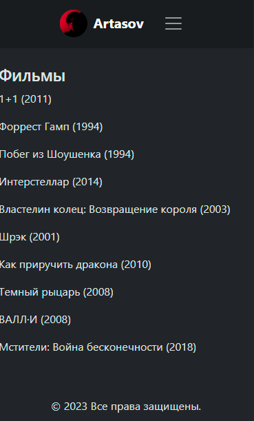

# Кинопоиск. Шапка и страничка с фильмами

Не используем готовую карточку `bootstrap`, напишите её самостоятельно. 

С Frontend курса, у довольно _**сильных**_ учеников, на мой взгляд,
_**очень слабые**_ знания об элементарном размещении элементов.

Достаточно объяснить 4 свойства:
* `display: flex` - включает использование `flex-direction` `justify-content-center` `gap` `align-items`


1. ## Немного переделаем шапку
    Сделаем ссылки на все фильмы, жанры актеров и режиссеров.
    Мы уже это делали, единственное новое, что я тут использовал это
    `gap-md` и `mt-md`, но для слабых учеников это не сильно нужно на данном этапе.
    Так же я объединил иконки профиля, выхода и смены темы в один блок с `d-flex` чтобы
    на телефоне при разворачивании меню они стояли в ряд. Все делать необязательно.
    ```html
    <!-- Core/includes/header.html -->
    <header>
        ..........
        <div class="collapse navbar-collapse flex-grow-0" 
             id="navbarSupportedContent">
            <ul class="navbar-nav mb-2 mb-lg-0 gap-3 gap-md-1 align-items-center">
                <li class="nav-item mt-3 mt-md-0">
                    <a class="nav-link py-0"
                       href="">
                        Фильмы
                    </a>
                </li>
                <li class="nav-item">
                    <a class="nav-link py-0"
                       href="">
                        Жанры
                    </a>
                </li>
                <li class="nav-item">
                    <a class="nav-link py-0"
                       href="">
                        Актёры
                    </a>
                </li>
                <li class="nav-item">
                    <a class="nav-link py-0"
                       href="">
                        Режиссёры
                    </a>
                </li>
                <li class="d-flex justify-content-center gap-2">
                    
                        <div class="nav-item">
                            <a class="py-0"
                               href="">
                                
                            </a>
                        </div>
                        <div class="nav-item my-auto">
                            <a class="py-0"
                               href="">
                                
                            </a>
                        </div>
                    
                        <div class="nav-item my-auto">
                            <a class="btn btn-secondary py-0"
                               href="">
                                Sign In
                            </a>
                        </div>
                        <div class="nav-item my-auto">
                            <a class="btn btn-secondary py-0"
                               href="">
                                Sing Up
                            </a>
                        </div>
                    
                    <div class="nav-item">
                        
                    </div>
                </li>
            </ul>
        </div>
        ...
    </header>
    ```
    * ### Сейчас страница с фильмами должна выглядеть как-то так:
        

2. ## Пишем карточку
    Скачайте `addon` к `bootstrap` для более быстрой верстки
    **[wide-classes](https://artasov.github.io/wide-classes/)**.<br>
    Переместите `wide-classes.css` в `Core/static/Core/css/` и подключите в `base.html`    
    
    > Естественно вы можете использовать просто классы bootstrap.
    Но согласитесь надпись <br>
    `d-flex flex-column justify-content-center align-items-center`<br>
    длиннее чем<br>
    `fccc`<br>
    Главное объяснить по какой логике строятся подобные классы.

    ```html
    <link type="text/css" rel="stylesheet"
          href=""/>
    ```
    ```html
    
    Кинопоиск | Фильмы
    
        <h1 class="text-center mb-4">Фильмы</h1>
        <div class="frc flex-wrap gap-4 mw-1000px mx-auto">
            
                <div class="fc mw-300px w-100 hover-scale-2">
                    
                    <h3 class="mt-2">{{ movie.title }}</h3>
                    <span class="frsc gap-2">
                        <span>Рейтинг:</span>
                        <span class="fs-5" style="color: #ffe655; padding-bottom: 1px;">
                            {{ movie.rating }}
                        </span>
                    </span>
                    <p>
                        
                            {{ genre.name }}, 
                        
                    </p>
                    <span class="text-secondary mt-auto">{{ movie.release_date }}</span>
                </div>
            
        </div>
    
    ```
    Чтобы дата отображалась на русском установите русский язык в `settings.py`
    ```python
    # settings.py
    LANGUAGE_CODE = 'ru-RU'
    ```
    Так как карточки фильмов будут не только на этой странице, дабы не
    копипастить код, вынесем карточку в отдельный шаблон.
    ```html
    <!-- kinopoisk/templates/kinopoisk/includes/movie_card.html -->
    <div class="fc mw-300px w-100 hover-scale-2">
        
        ...
        <span class="text-secondary mt-auto">{{ movie.release_date }}</span>
    </div>
    ```
    И используем его.
    ```html
    
    Кинопоиск | Фильмы
    
        <h1 class="text-center mb-4">Фильмы</h1>
        <div class="frc flex-wrap gap-4 mw-1000px mx-auto">
            
                <!-- Передаем переменную с объектом фильма -->
                
            
        </div>
    
    ```

Должно получиться примерно так.

## Загрузите проект на гит если еще не загружали.

## Подведите итоги.
># git push...