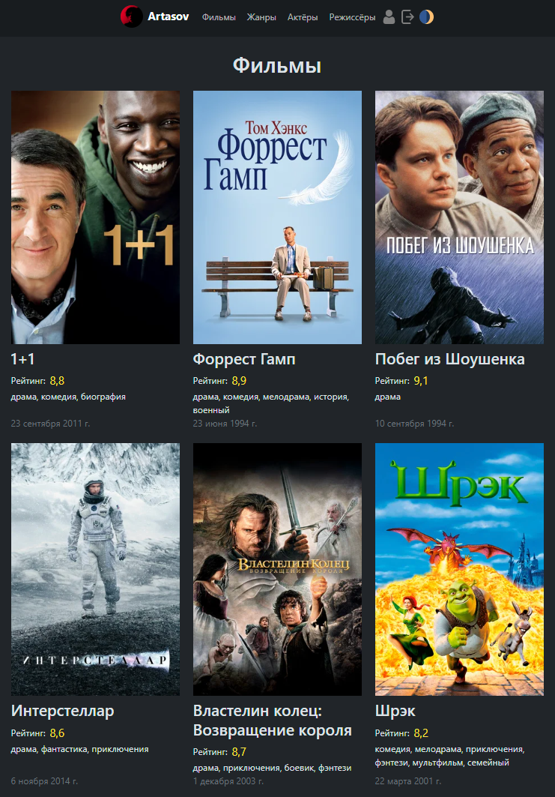

# Жанры, актеры, режиссеры


1. ## Жанры
    Страничка с жанрами сегодня будет самая простая, нужно просто 
    вывести их названия в более менее красивом виде.
    ```html
   
   Кинопоиск | Жанры
   
       <h1 class="text-center mb-3">Жанры</h1>
       <div class="frc flex-wrap mw-700px mx-auto gap-2">
           
               <a href="" 
                  class="px-3 py-2 fs-5 bg-black-25 rounded-3 text-light 
                         text-decoration-none disable-tap-select hover-scale-4">
                   <!-- Используем так называемые фильтры,
                   чтобы каждый жанр выводился с большой буквы -->
                   {{ genre.name|title }}
               </a>
           
       </div>
   
    ```

2. ## Актеры и режиссеры
    Помним, что мы передаем заголовок и персон в функцию `render`.
    Расскажите, что можно делать сортировку при использовании ORM.
    > По умолчанию сортировка выполняется по id
    ```python
    def actor_list(request):
        # Выполним сортировку в обратном порядке, но тоже по id.
        # Можете использовать и другие поля, не принцыпиально.
        actors = MoviePerson.objects.filter(
            role=MoviePerson.RoleType.ACTOR
        ).order_by('-id') 
        return render(request, 'kinopoisk/person_list.html', {
            'persons': actors, 'title': 'Актеры'
        })
    ```
    ### Оформляем страничку
    > Ничего сложного, ученики, наверное, справятся сами.
    ```html
    <!-- kinopoisk/person_list.html -->
    
    Кинопоиск | {{ title }}
    
        <h1 class="text-center mb-3">{{ title }}</h1>
        <div class="frc flex-wrap mw-700px mx-auto gap-2">
            
                <a href="Оставляем пустым пока что" 
                   class="fc gap-2 mw-150px w-100 text-light text-decoration-none hover-scale-2">
                    
                    <h2 class="fs-6">{{ person.name }}</h2>
                </a>
            
        </div>
    
    ```

3. ## Добавим новый фильм, улучшим читаемость объектов моделей 
    * Зайдите в админку и попробуйте добавить любой фильм.
       Вы столкнетесь с проблемой непонятных названия жанров и персон.
       > Предупреждать заранее наверное, не нужно, а может и нужно 🙃
    * Используйте [дополнительные материалы для уроков](https://github.com/Artasov/it-compot-backend-lessons/blob/main/lessons/additionally/additionally.md#%D1%83%D0%BB%D1%83%D1%87%D1%88%D0%B5%D0%BD%D0%B8%D0%B5-%D1%87%D0%B8%D1%82%D0%B0%D0%B1%D0%B5%D0%BB%D1%8C%D0%BD%D0%BE%D1%81%D1%82%D0%B8-%D0%BD%D0%B0%D0%B7%D0%B2%D0%B0%D0%BD%D0%B8%D1%8F-%D0%BC%D0%BE%D0%B4%D0%B5%D0%BB%D0%B8-%D0%B8-%D0%B5%D1%91-%D0%BE%D0%B1%D1%8A%D0%B5%D0%BA%D1%82%D0%BE%D0%B2-%D0%B2-ui-user-interface) и исправьте ситуацию.
      ```python
      # kinopoisk/models.py
      class MoviePerson(models.Model):
          ...
          def __str__(self):
              return self.name
      
      class Genre(models.Model):
          ...
          def __str__(self):
              return self.name
      
      class Movie(models.Model):
          ...
          def __str__(self):
              return self.title
      ```
    * Добавьте фильм его актеров и режиссеров.

## Должно получиться как-то так:


### Можете сделать что-то из доп. материалов, либо поработать над пробелами в знаниях, либо идти дальше.

## Загрузите проект на гит если еще не загружали.

## Подведите итоги.
># git push...