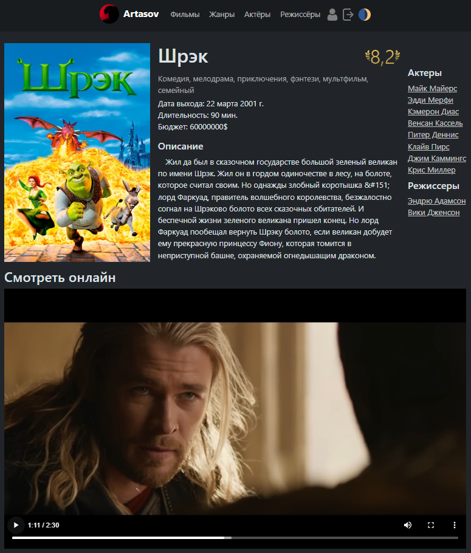
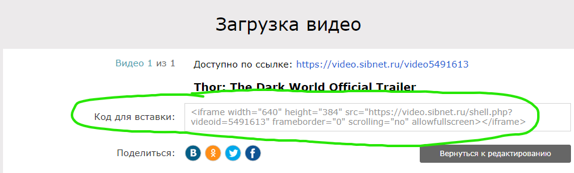

# Страница фильма

Сегодня мы оформим страницу для детального отображения информации о фильме.
Чтобы на странице был плеер нужно где-то хранить фильмы. 
Создадим для этого новое поле в модели `Movie`. 

1. ## Добавляем поле `movie_file` в модель `Movie`
    ```python
    # kinopoisk/models.py
    class Movie(models.Model):
        ...
        movie_file = models.FileField(
            upload_to='kinopoisk/images/movies/movie_files/',
            null=True, blank=True)
        ...
    ```
    > Про миграции ученики скорее всего вспомнят сами когда появится ошибка из-за них :)
    
    > Напомните, что такое медиа файлы и как они работают (FileField - хранит именно их).

    Стоит сказать, что на настоящих проектах большие объемы файлов никто
    не хранит на backend сервере. Зачастую используются специальные 
    сервера-хранилища, например AmazonS3Storage или подобные ему.
    
2. ## Сделай каждый фильм в списке фильмов ссылкой
    > Вспоминаем про динамические маршруты
    ```html
    <!-- kinopoisk/templates/kinopoisk/includes/movie_card.html -->
    <a href=""
       class="movie_card text-decoration-none text-light fc mw-300px w-100 hover-scale-2">
        ...
    </a>
    ```

3. ## Скачайте трейлер фильма с Youtube и загрузите через админку
   > [Скачивание в 1080p](https://y2down.cc/en/)

4. ## Выведем информацию о фильме
    > Я показываю максимальный вариант, а вы подстраивайтесь под уровень учеников.
    ```html
    <!-- kinopoisk/movie_detail.html -->
    
    
    
        <link rel="stylesheet" href="">
    
    {{ movie.title }}
    
        <div class="fccc mw-950px mx-auto px-2">
            <div class="fccs justify-content-md-center flex-md-row m-sm-0 gap-3 mx-auto">
                
                <div class="fc mx-auto mx-md-0">
                    <div class="fr gap-2">
                        <h1 class="mb-0 me-auto text-center d-inline">{{ movie.title }}</h1>
                        <div class="frcc">
                            
                            <span class="rating-color fs-1">{{ movie.rating }}</span>
                            
                        </div>
                    </div>
                    <span class="text-secondary-emphasis mt-2 mb-1">
                        
                            <span>
                                {{ genre.name|title }}{{ genre.name }},
                            </span>
                        
                    </span>
                    <span class="me-md-auto d-inline">Дата выхода: {{ movie.release_date }}</span>
                    <span class="me-md-auto d-inline">Длительность: {{ movie.duration }} мин.</span>
                    <span class="me-md-auto d-inline">Бюджет: {{ movie.budget }}$</span>
                    <h5 class="mt-3">Описание</h5>
                    <p class="mb-3" style="text-indent: 1rem">{{ movie.description }}</p>
                </div>
                <div class="mt-md-5 mt-0">
                    <div class="mb-2">
                        <h5>Актеры</h5>
                        <ul class="fc">
                            
                                <li>
                                    <a href=""
                                       class="text-light text-opacity-75 text-nowrap">
                                        {{ actor.name }}
                                    </a>
                                </li>
                            
                        </ul>
                    </div>
                    <div>
                        <h5>Режиссеры</h5>
                        <ul class="fc">
                            
                                <li>
                                    <a href=""
                                       class="text-nowrap text-light text-opacity-75">
                                        {{ director.name }}
                                    </a>
                                </li>
                            
                        </ul>
                    </div>
                </div>
            </div>
            <div class="fcc mt-2">
                <h3>Смотреть онлайн</h3>
                <video src="{{ movie.movie_file.url }}" controls
                       class=" w-100"></video>
            </div>
        </div>
    
    ```
    ```css
    /* kinopoisk/static/kinopoisk/css/movie.css */
    .rating-color {
        background: #FCCF5D;
        background: linear-gradient(to bottom, #FCCF5D 0%, #B39445 100%);
        -webkit-background-clip: text;
        -webkit-text-fill-color: transparent;
        line-height: calc(1.375rem + 1.5vw) !important
    }
    ```
    ### Desktop
    
    ### Mobile
    
    
    **Здесь мы загружаем файл фильма целиком при загрузке 
    страницы, что с полным фильмом и наличием хостинга будет очень 
    сильно тормозить загрузку страницы. На настоящих проектах используется 
    загрузка видео батчами, последовательными кусками, которые подгружаются 
    постепенно по мере вашего просмотра.**
    

## Подведите итоги.
># git push...