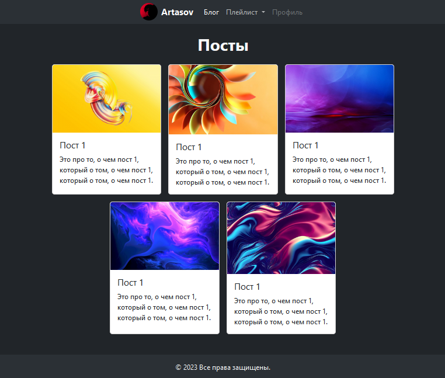
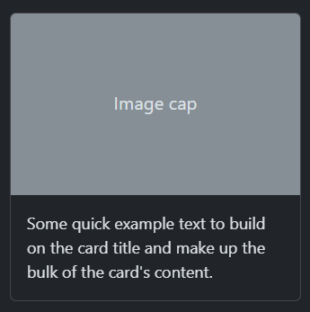

# Шаблонизация

### Продолжаем 'Личный блог'.<br>
>Можете если хотите показать что примерно мы будем делать.<br><br>

## Header, Footer и карточка товара.

1. Создаем страницу где будут отображаться все посты.
   ```python
    # blog/views.py
    def posts_list(request):
        return render(request, 'blog/posts_list.html')
   ```
   ```python
   # project_name/urls.py
   from blog.views import posts_list  # импортируем функцию
   
   urlpatterns = [
       path('posts_list/', posts_list),  # связываем маршрут и функцию
   ]
   ```
2. Показываем ребятам **[документацию Bootstrap](https://getbootstrap.com/docs/5.3/components/card/)**, 
   а именно раздел где есть разные готовые элементы.<br>
   Возьмем оттуда header и карточку поста.
   Лучше брать без кнопки карточку и сделать её потом ссылкой.
   > Лучше взять карточку без кнопки, чтобы потом сделать всю ее ссылкой. Не забываем подключить `bootstrap.min.css`

   
   ```html
   <header>
       <nav class="navbar navbar-expand-lg bg-body-tertiary">
           ...
       </nav>
   </header>
   <main>
       <h1 class="text-light text-center fw-bold">Посты</h1>
       <div class="card" style="width: 250px;">
           
           <div class="card-body">
               <h5 class="card-title">Заголовок</h5>
               <p class="card-text">Текст текст текст текст</p>
           </div>
       </div>
   </main>
   <footer>
   ...
   </footer>
   ```

3. Когда доверстали, даем подумать как можно передать в товар с `id=1` (можно подсмотреть в 
   шпаргалке [ORM Django](https://github.com/Artasov/itcompot-methods/blob/main/django-base.md#orm)).<br> 
   Находим `objects.get(id=1)`, вспоминаем как мы передавали переменные в шаблон. Желательно чтобы ученики сами додумались.
   ```python
   # blog/views.py
   from .models import Post
   def posts_list(request):
       post = Post.objects.get(id=1)
       return render(request, 'blog/posts_list.html', {'post': post})
   ```
   
4. Рассказываем как отобразить этот 1 пост.
   ```html
   <div class="card" style="width: 250px;">
       
       <div class="card-body">
           <h5 class="card-title">{{ post.title }}</h5>
           <p class="card-text">{{ post.text }}</p>
       </div>
   </div>
   ```
5. Пусть сами попробуют по примеру в шпаргалке <br>
   [Использование условий и циклов](https://github.com/Artasov/itcompot-methods/blob/main/django-base.md#%D0%B8%D1%81%D0%BF%D0%BE%D0%BB%D1%8C%D0%B7%D0%BE%D0%B2%D0%B0%D0%BD%D0%B8%D0%B5-%D1%86%D0%B8%D0%BA%D0%BB%D0%BE%D0%B2-%D0%B8-%D1%83%D1%81%D0%BB%D0%BE%D0%B2%D0%B8%D0%B9-%D0%B2-%D1%88%D0%B0%D0%B1%D0%BB%D0%BE%D0%BD%D0%B5)
   и
   [ORM Django](https://github.com/Artasov/itcompot-methods/blob/main/django-base.md#orm)
   сделать отображение всех постов.
   ```python
   # blog/views.py
   from .models import Post
   def posts_list(request):
       posts = Post.objects.all()
       return render(request, 'blog/posts_list.html', {'posts': posts})
   ```
   ```html
   <main>
       <h1 class="text-light text-center fw-bold">Посты</h1>
       <div class="posts_container d-flex gap-3 flex-wrap justify-content-center mx-auto" 
            style="max-width: 800px;">
           
               <div class="card" style="width: 250px;">
                   
                   <div class="card-body">
                       <h5 class="card-title">{{ post.title }}</h5>
                       <p class="card-text">{{ post.text }}</p>
                   </div>
               </div>
           
       </div>
   </main>
   ```
6. Пусть ученики добавят проверку доступности поста по той же шпаргалке.
   Тогда будут отображаться только опубликованные посты.
   ```html
   <main>
       <h1 class="text-light text-center fw-bold">Посты</h1>
       <div class="posts_container d-flex gap-3 flex-wrap justify-content-center mx-auto" 
            style="max-width: 800px;">
           
               
                   <div class="card" style="width: 250px;">
                       
                       <div class="card-body">
                           <h5 class="card-title">{{ post.title }}</h5>
                           <p class="card-text">{{ post.text }}</p>
                       </div>
                   </div>
               
           
       </div>
   </main>
   ```
> # git push...


