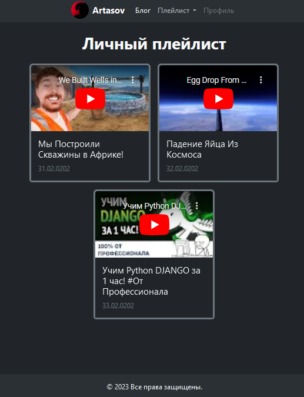
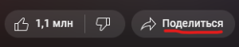
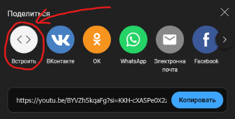

# Создание личного плейлиста

В данной методичке, мы создадим новое приложение, где пользователь сможет собрать свой личный плейлист видео.
>Можете если хотите показать что примерно мы будем делать.<br><br>



1. ## Cоздадим новое приложение `playlist`.

   `python manage.py startapp playlist`
2. ## Показываем как можно встроить видео с YouTube.
   - **Открываем видео, нажимаем поделиться.**<br>
       <br><br>
   


   - **Нажимаем встроить.**<br>
      <br><br>
   


   - **Объясняем, что такое `iframe`, и что нужно будет хранить в базе данных только `embed code`.**<br><br>
       <br><br>


3. ## Создадим модель `Video`, где будут храниться название видео и ссылка для его встраивания в `iframe`.
   ```python
   # playlist/models.py
   from django.db import models
   
   class Video(models.Model):
       title = models.CharField(max_length=200)
       embed_code = models.TextField()
       created_at = models.DateTimeField(auto_now_add=True)
   
       def __str__(self):
           return self.title
   ```
   #### Мигрируем модель в db
   `python manage.py makemigrations`<br>
   `python manage.py migrate`

5. ## Зарегистрируем модель в `admin.py` для управления через административную панель.
   ```python
   # playlist/admin.py
   from django.contrib import admin
   from .models import Video
   
   admin.site.register(Video)
   ```
6. ## Создадим представление, которое будет отображать все видео из плейлиста.
   ```python
   # playlist/views.py
   from django.shortcuts import render
   from .models import Video
   
   def video_list(request):
       videos = Video.objects.all()
       return render(request, 'playlist/video_list.html', {'videos': videos})
   ```
7. ## Свяжем `video_list()` с адресом `playlist/video_list/`.
   ```python
   # project_name/urls.py
   from django.urls import path
   from . import views
   
   urlpatterns = [
       path('playlist/video_list/', views.video_list, name='video_list'),
   ]
   ```

   
   
8. ## Создадим шаблон для отображения видео используя `iframe` и шпаргалку [циклы](https://github.com/Artasov/itcompot-methods/blob/main/django-base.md#%D0%B8%D1%81%D0%BF%D0%BE%D0%BB%D1%8C%D0%B7%D0%BE%D0%B2%D0%B0%D0%BD%D0%B8%D0%B5-%D1%86%D0%B8%D0%BA%D0%BB%D0%BE%D0%B2-%D0%B8-%D1%83%D1%81%D0%BB%D0%BE%D0%B2%D0%B8%D0%B9-%D0%B2-%D1%88%D0%B0%D0%B1%D0%BB%D0%BE%D0%BD%D0%B5).  
   >Используем Bootstrap, header, footer берем с предыдущей страницы. 

   **`Когда сделаете`**, обратите внимание, что часть кода (*header, footer*) дублируется. 
   Применим `include` для `повторного использования` header и footer.
      > Создайте в папке с шаблонами новую папку `includes` 
      и поместите туда файлы `header.html` и `footer.html`. 
      В эти файлы поместим код header'а и footer'а соответственно.
      ### Результат
      ```html
      <!-- playlist/templates/playlist/video_list.html -->
      
      <main>
          
              <div class="card rounded-top-3 border-5 border-secondary bg-dark" 
                   style="width: 275px;">
                  <iframe class="rounded-top-3"
                          src="https://www.youtube.com/embed/{{ video.embed_code }}" 
                          frameborder="0" 
                          allow="accelerometer; autoplay; clipboard-write; encrypted-media; gyroscope; picture-in-picture; web-share" allowfullscreen></iframe>
                  <div class="card-body">
                      <h5 class="card-title text-light">{{ video.title }}</h5>
                      <p class="card-text text-secondary">{{ video.created_at }}</p>
                  </div>
              </div>
          
      </main>
      
      ```
      > Обращаем внимание, что мы храним в бд только часть ссылки (`embed_code`), 
      > вместо всей ссылки или всего iframe.


Все готово!

># git push...