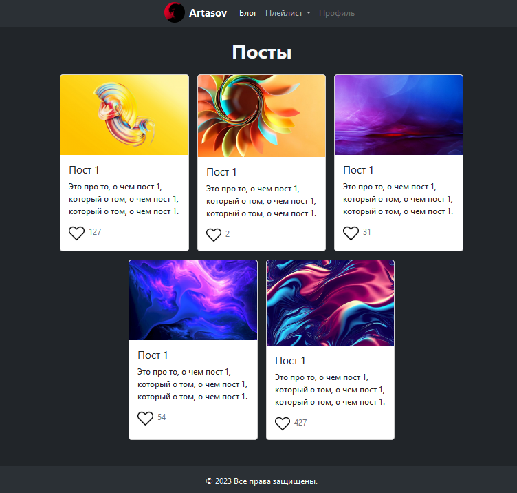

# Использование URL-имен и редиректов

В этом руководстве мы углубимся в работу с URL-именами и редиректами, <br>
а также создим рабочую навигацию в шапке.

1. ## URL naming & redirect
   Рассказываем, что такое имена `для url`, `redirect'ы` и зачем это нужно.<br>
   Показываем раздел _**шпаргалки**_ ([Именование маршрутов и перенаправления](https://github.com/Artasov/itcompot-methods/blob/main/django-base.md#url-naming--redirects-%D0%B8%D0%BC%D0%B5%D0%BD%D0%BE%D0%B2%D0%B0%D0%BD%D0%B8%D0%B5-%D0%BC%D0%B0%D1%80%D1%88%D1%80%D1%83%D1%82%D0%BE%D0%B2-%D0%B8-%D0%BF%D0%B5%D1%80%D0%B5%D0%BD%D0%B0%D0%BF%D1%80%D0%B0%D0%B2%D0%BB%D0%B5%D0%BD%D0%B8%D0%B5))
   
      * #### Зададим имя для url установки лайка.
           ```python
           # project_name/urls.py
           urlpatterns = [
               path('blog/post_like/', post_like, name='post_like'),
           ]
           ```
      * #### Используем это имя в форме для отправки лайка.
           ```html
           <!-- blog/posts_list.html-->
           <!-- Заменим это -->  
           <form action="http://127.0.0.1:8000/blog/post_like/" method="post" class="d-flex flex-row">
           <!-- На это -->     
           <form action="" method="post" class="d-flex flex-row">   
           ```
      * #### Используем redirect после обработки лайка.
           ```python
           # blog/views.py
           def post_like(request):
               if request.method == 'POST':
                   post_id = request.POST['post_id']
                   post = Post.objects.get(id=post_id)
                   post.likes += 1
                   post.save()
               return redirect('post_like')
           ```
   
2. ## Много самостоятельной работы.
   Напоминаем, что мы все еще переходим по ссылкам вписывая их в адресную строку руками.<br>
   Хотелось бы реализовать рабочую навигацию в шапке <br>
   и сделать отдельную кнопку для добавления видео на странице со всеми видео.<br>
   Так же после добавления видео нас должено перенаправлять на страницу со всеми видео.<br>
   Дальше используя полученные знания о именах и шаблонизации ссылок, пусть ребята сами реализуют этот функционал.<br><br>
   ### По итогу должно получиться что-то такое:
   
   * Кнопка на странице со всеми видео для перехода к странице добавления видео.<br><br>
   
      
      ```python
      # project_name/urls.py
      urlpatterns = [
          ...
          path('playlist/video_list/', views.video_list, name='video_list'),
          path('video/new/', video_create, name='video_create'),
          path('blog/posts_list/', posts_list, name='posts_list'),
          ...
      ]
      ```
      ```python
      # playlist/views.py
      from .models import Video
      
      def video_create(request):
          if request.method == "POST":
              title = request.POST['title']
              embed_code = request.POST['embed_code']
              Video.objects.create(title=title, embed_code=embed_code)
              return redirect('video_list')  # перенаправляем на страницу со всеми видео.
          return render(request, 'playlist/video_create.html')
      ```
      ```html
      <!-- app1/templates/app1/includes/header.html -->
      ...
      <ul class="navbar-nav mb-2 mb-lg-0">
          <li class="nav-item">
              <a class="nav-link active" aria-current="page" 
                 href="">
                 Блог</a>
          </li>
          <li class="nav-item">
              <a class="nav-link" aria-current="page" 
                 href="">
                 Плейлист</a>
          </li>
          <li class="nav-item">
              <a class="nav-link disabled" aria-disabled="true">Профиль</a>
          </li>
      </ul>
      ...
      ```
      ```html
      <!-- playlist/templates/playlist/video_list.html -->
      
          <div class="d-flex flex-column flex-sm-row justify-content-center gap-3 mb-4">
              <h1 class="text-light text-center fw-bold">Личный плейлист</h1>
              <a href="" <!-- Используем имя -->
                 class="btn btn-danger my-auto mx-auto mx-sm-0"
                 style="max-width: 150px;">
                  Добавить
              </a>
          </div>
          <div class="d-flex gap-3 flex-wrap justify-content-center mx-auto" style="max-width: 800px;">
              <div class="card......
      
      ```

>В этом руководстве мы научились использовать URL-имена для создания читаемых и гибких ссылок, а также реализовали переходы после лайка и добавления видео. Рабочая навигация в шапке теперь обеспечит удобство перемещения по сайту.

># git push...